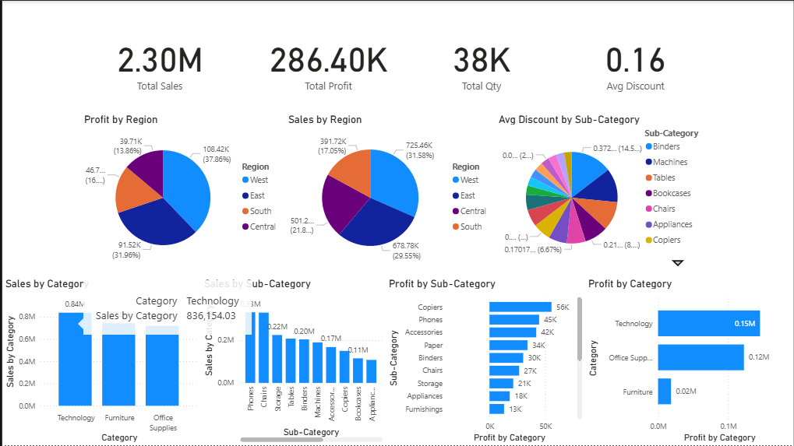
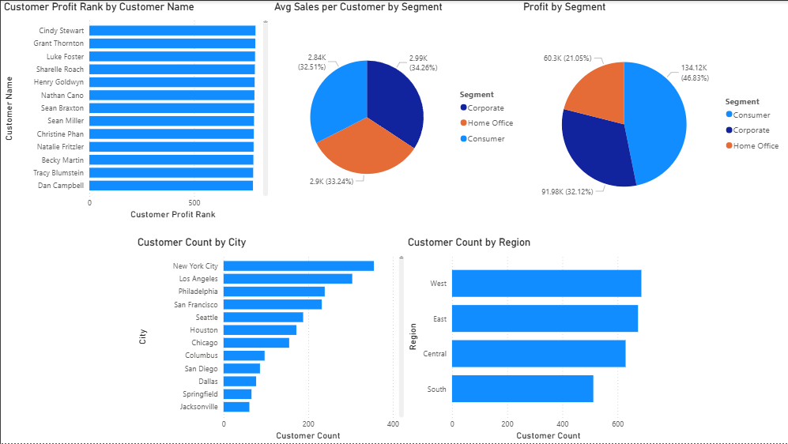

Superstore Sales Analysis

📊 Project Overview
This project provides an in-depth analysis of the **Superstore Sales Dataset** to uncover business insights and identify critical areas for decision-making.  
The analysis focuses on:
- Sales performance by region, category, and customer segment
- Profitability trends
- Key performance metrics using DAX calculations
- Interactive dashboards for business intelligence

---

🛠 Tools Used
- **Power BI** – For building interactive dashboards and visual analytics
- **Microsoft Excel** – For initial data cleaning and preparation
- **DAX (Data Analysis Expressions)** – For creating calculated measures and KPIs

---

 📈 Dashboard Overview
Below are sample screenshots from the interactive dashboard:

1. Main Dashboard Overview  

  
  

2. 🧮 DAX Measures Used

- Averages & Counts
Avg Discount = AVERAGE(orders_clean[Discount])
Avg Profit per Customer = DIVIDE([Total Profit], DISTINCTCOUNT(orders_clean[Customer ID]))
Avg Sales per Customer = DIVIDE([Total Sales], DISTINCTCOUNT(orders_clean[Customer ID]))
Customer Count = DISTINCTCOUNT(orders_clean[Customer Name])

- Rankings
Customer Profit Rank =
RANKX(
    ALL(orders_clean[Customer Name]),
    [Total Profit],
    ,
    DESC,
    DENSE
)

- Profit Calculations
Profit by Category = SUM(orders_clean[Profit])
Profit by Customer = SUM(orders_clean[Profit])
Profit by Region = SUM(orders_clean[Profit])
Profit by Segment = SUM(orders_clean[Profit])
Profit Growth % = DIVIDE([Total Profit] - [Profit LY], [Profit LY])
Profit LY = CALCULATE([Total Profit], SAMEPERIODLASTYEAR(orders_clean[Order Date]))
Profit Margin = DIVIDE([Total Profit], [Total Sales])
Profit MTD = TOTALMTD([Total Profit], orders_clean[Order Date])
Profit YTD = TOTALYTD([Total Profit], orders_clean[Order Date])

- Sales Calculations
Sales by Category = SUM(orders_clean[Sales])
Sales by Region = SUM(orders_clean[Sales])
Sales Growth % = DIVIDE([Total Sales] - [Sales LY], [Sales LY])
Sales LY = CALCULATE([Total Sales], SAMEPERIODLASTYEAR(orders_clean[Order Date]))
Sales MTD = TOTALMTD([Total Sales], orders_clean[Order Date])
Sales YTD = TOTALYTD([Total Sales], orders_clean[Order Date])

- Totals
Total Profit = SUM(orders_clean[Profit])
Total Qty = SUM(orders_clean[Quantity])
Total Sales = SUM(Orders_Clean[Sales])

- Year-over-Year Growth
YoY Sales Growth % =
VAR CurrentSales = SUM(orders_clean[Sales])
VAR LastYearSales =
    CALCULATE(
        SUM(orders_clean[Sales]),
        SAMEPERIODLASTYEAR('DateTable'[Date])
    )
RETURN
    IF(
        ISBLANK(LastYearSales),
        BLANK(),
        DIVIDE(CurrentSales - LastYearSales, LastYearSales)
    )

🧮 Key DAX Measures
DAX
Total Sales = SUM ( Orders_Clean[Sales] )

Total Profit = SUM ( Orders_Clean[Profit] )

Total Quantity = SUM ( Orders_Clean[Quantity] )

Average Discount = AVERAGE ( Orders_Clean[Discount] )

Profit Margin % = DIVIDE ( [Total Profit], [Total Sales] )

Sales per Customer = DIVIDE ( [Total Sales], DISTINCTCOUNT ( Orders_Clean[Customer ID] ) )

💡 Key Insights

- High Sales, Low Profit in Technology Category

- While Technology drives significant revenue, profit margins are thinner compared to Furniture.

- West Region Outperforms in Sales

- West leads in total sales but has moderate profit margins, requiring targeted marketing to improve profitability.

- Customer Segment Trends

- Consumer segment dominates in both sales and profits, suggesting potential for loyalty programs.

- Seasonal Sales Patterns

- Q4 consistently delivers higher sales, indicating an opportunity for targeted year-end campaigns.

🎯 Business Recommendations
Focus marketing efforts on the Technology category to improve margins.
Implement cost control strategies in high-revenue but low-profit regions.
Develop customer loyalty programs targeting the Consumer segment.
Plan promotional campaigns in Q4 to capitalize on seasonal trends.

📌 How to View the Dashboard

- Download the .pbix file from this repository.

- Open it in Power BI Desktop.

- Explore interactive features to filter and drill down into data.
